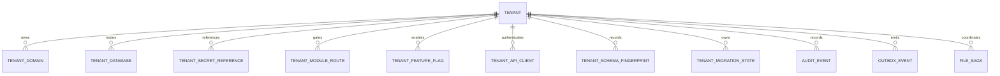

# Control-plane model

`ais_next_control` is the only database migrated by AIS Next. It must have independent backup, least-privilege credentials and no foreign keys to tenant databases.

`tenant_database` has exactly one descriptor per `(tenant, CORE|FILE)`. It stores a JDBC URL and credential reference, never the credential. `tenant_module_route` determines which application handles a route while `tenant_migration_state` tracks aggregate write ownership; these are related but deliberately separate controls. `security_handoff_nonce` atomically prevents token replay and stores only a SHA-256 nonce digest.

Flyway migration `db/control/V1__control_plane.sql` creates these tables. It is wired to the explicitly named control datasource, not either routing datasource.
